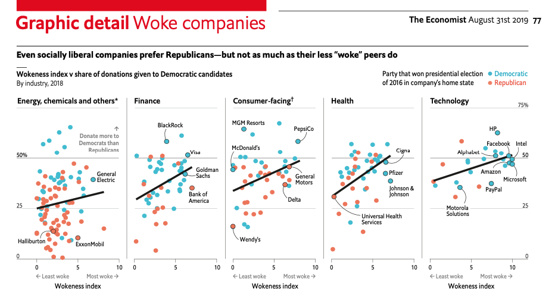

__The deliverable for this lab is a written analysis submitted both as an HTML and Rmd file. The files must be submitted on Moodle by 8pm on Friday, March 11, 2022. Late assignments will not be accepted. Note that the instructor and TAs will not be available for assistance after 5pm on Friday.__


In this lab, you will analyze data from the US National Health and Nutrition Examination Study. As described in the help file for the `NHANES` package:
> This is survey data collected by the US National Center for Health Statistics which has conducted a series of health and nutrition surveys since the early 1960's. Since 1999 approximately 5,000 individuals of all ages are interviewed in their homes every year and complete the health examination component of the survey. The health examination is conducted in a mobile examination centre.

You will conduct an open-ended analysis, on variables of your choice, to investigate whether an interaction exists between variables in the dataset. The central deliverable for the analysis portion of the assignment is a figure showing a hypothesized interaction between your response variable and your primary and secondary explanatory variables. You must use facets and/or color to illustrate the hypothesized interaction. If you have additional explanatory variables you may map them to additional aesthetics in your figure (e.g. color, shape)

## The assignment
The deliverable for this lab a written analysis submitted as a reproducible HTML document, using RMarkdown. You must include expository text answers as text in the document (not code comments). All code should be shown in the post. The file must be submitted on Moodle by 8pm on Friday, March 11, 2022. Late assignments will not be accepted. The assignment must contain your name, and the date.

You must use the `NHANES` data object in the `NHANES` package for R. The variables you choose to focus on for your analysis is up to you. Once the package is installed, you can use the following code to load the dataset.

```{r}
library(NHANES)
data(NHANES)
```

The analysis should be readable and understandable ``out of context'' for someone reading it. It must contain the following sections and content:

- (5 points) Introduction: This section should briefly introduce NHANES, and define the variables that you will be looking at. You must clearly define the response and explanatory variables and state what your initial hypothesis was about how they would be related to each other (it's ok if it ended up not being right). You must also clearly state what the sampling frame is for the dataset and what the unit of analysis is for the dataset.
<!--    % 1 pt: appropriate definition of response/explanatory variables. 
    % 1 pt: statement of the initial hypothesis.
    % 2 pts: Sampling frame: partial credit for something like "the entire US population", full credit for saying something like "the non-institutionalized civilian resident population of the United States" which is what is said in the help file.
    % 1 pt: unit of analysis: an individual human 
    -->
- (12 points) Analysis: This section should provide details about your analysis, following the instructions provided below. If you have subset the dataset to focus on, or your variables are only available for, a particular subpopulation, please state that clearly. For each chosen variable, you should provide an appropriate data summary (e.g. histogram, density plot, table) showing the distribution of observed values. You must show a scatterplot with the hypothesized interactions shown in lines (either straight or smoothed) and interpret the results, including whether you think outlying points might be influencing the lines/curves. You are not expected to fit a regression model, only to show a figure and interpret it. 
<!--     % 3 pts: appropriate figures and summaries for every variable
    % 4 pts: interaction plot shows points and lines with facets or colors
    % 3 pts: interaction plot is clearly and accurately interpreted
    % 2 pts: they included a statement about possible influence of outliers (even if they don't think there is one)
    -->
- (3 points) Discussion: Summarize your findings in a few sentences.The entire report should be ``clean'': it should be clearly organized with appropriately sized figures and good use of explanatory text.
<!--    % 1 pt: there is a coherent summary of the results
    % 1 pt: figures are appropriate sized
    % 1 pt: there are text descriptions for every figure
-->

The goal is to have an analysis that resembles something like the Woke Companies analysis from the Graphic Detail that we discussed in class last week  (see below). Note they have a single response variable and, as we identified last week in class, 3 explanatory variables, with the primary explanatory variable of wokeness, secondary explanatory variable of industry, and third of party affiliation of home state.




## Important instructions

- Start by reading the entire help file for the `NHANES` data object. This document contains information that you will need to include in the analysis to answer the questions above AND has a complete list of the variables available in the dataset.
- Identify a three variables (that meet the criteria below) that you hypothesize might show an interesting relationship. Write down your hypothesis about how you think the variables might be related. 
- Here are some guidelines for choosing variables: (a) you must choose a response variable that is either continuous OR discrete with >15 unique values in the dataset, (b) you must choose one primary explanatory variable that similarly is either continuous or discrete with >15 unique values, (c) you must choose one secondary explanatory variable that is discrete/categorical with a small-ish number of categories (or it could have more categories but you will subset to have just a few), (d) you may choose additional explanatory variables to include, but this is not required.
- Before you lock in your topic, investigate whether there is enough available data in your chosen variables and that they have an interesting amount of variation. There is quite a bit of missing data in the NHANES data. It is suggested that you use code like the following as a starting place to check whether there is enough overlap between the variables that you've chosen, and to do some initial exploration of what the marginal and joint distributions of the chosen variables look like. You will not include this code in your final analysis

```{r, eval=FALSE}
## tells you how many observations for a variable are present
sum(!is.na(NHANES$SexAge))

## tells you how many observations for a set of three variables are present
sum(!is.na(NHANES$SexAge) & !is.na(NHANES$Age) & !is.na(NHANES$Gender)) 
```


## Helpful tips

- Iterate the steps above until you've found variables that have adequate overlap and variation. Note that you are NOT being asked to conduct a full analysis and see if there are ``interesting'' results before continuing. Choosing variables that don't show a strong interaction effect is fine, but you need to have variables that have enough observations with all variables measured. (You should have >3,000 observations that are completely observed for your chosen variables.)
- This assignment does not require you to fit an actual statistical model, all of the analysis can be done through data visualization. Although you can fit a statistical model if this is something that you are comfortable/familiar with.
- You should examine the plot for any severely outlying points and comment (again no need to actually fit a regression model) on whether you think they might be influencing the lines or curves you have drawn.
- The final report should be a lucid and linear report that follows the above outline. It should not be a jumble of figures without context. Every figure should be introduced and briefly summarized. 
